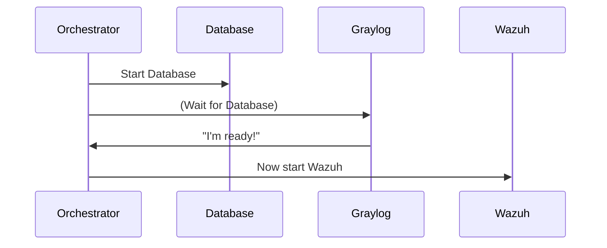

# Chapter 1: Security Component Orchestration

## The Security Orchestra

Imagine you're conducting an orchestra. Each musician (like violinists or trumpet players) is a security tool (Wazuh, Graylog, TheHive). Your job as conductor is to make them play together beautifully. That's exactly what Security Component Orchestration does for cybersecurity tools!

## Why Do We Need This?

Without orchestration:
- Tools start in random order (a trumpet plays before the violin is ready)
- They can't communicate (like musicians not hearing each other)
- Everything crashes if one tool fails (like the orchestra stopping if a flute breaks)

Our example use case: Starting a security system where:
1. Wazuh (our security detector) needs Graylog (our logger) to be ready first
2. TheHive (our incident responder) needs its database (Cassandra) before starting

## Orchestration in Action

Here's how simple it looks in code (using Docker Compose):

```yaml
# Wazuh waits for Graylog
services:
  wazuh:
    depends_on:
      - graylog
```

Key concepts:
- `depends_on`: Ensures proper startup order
- `networks`: Lets tools communicate (like musicians hearing each other)
- `healthchecks`: Confirms tools are really ready, not just running

## Inside the Conductor's Baton

What happens when we start the system?



1. The orchestrator checks all dependencies
2. Starts components in the right order
3. Verifies each is healthy before continuing

## Key Benefits

1. **Reliability**: No more "Why isn't my alert showing up?"
2. **Maintainability**: Change one tool without breaking others
3. **Visibility**: See all components working together

## Ready for More?

Now that we understand how to coordinate our security tools like an orchestra, we're ready to explore how they share information. In [Unified Logging/Monitoring](02_unified_logging_monitoring_.md), we'll see how these coordinated tools work together to keep our systems safe!

---

Generated by [AI Codebase Knowledge Builder](https://github.com/The-Pocket/Tutorial-Codebase-Knowledge)