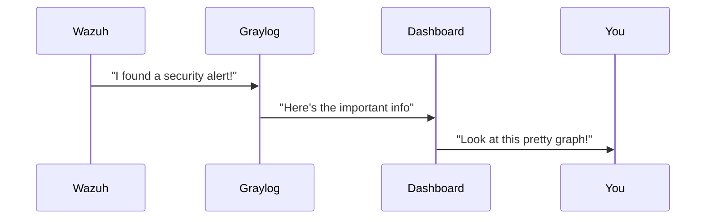
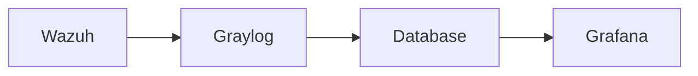

# Chapter 2: Unified Logging/Monitoring

## The Security Dashboard

Imagine you're a security guard watching 100 security cameras at once. Without a central monitor, you'd have to check each camera individually. That's what **Unified Logging/Monitoring** does for your security tools - it brings all their data to one place!

## Why Do We Need This?

Without unified monitoring:
- You'd check logs in 10 different places
- Important alerts might get lost in the noise
- You wouldn't see the full picture of what's happening

Our example use case: 
1. Collect logs from Wazuh (security alerts)
2. Send them to Graylog (log manager)
3. Display them in Grafana (visual dashboard)

## How It Works

Here's the simple version:



## Setting Up the Components

1. **Wazuh** (our security guard) sends logs:

```yaml
# In Wazuh config
output.logs_to_forward:
  - address: graylog.example.com
    port: 9000
```

2. **Graylog** receives and organizes them:

```yaml
# Graylog input config
input {
  gelf {
    port => 12201
  }
}
```

3. **Grafana** shows the data:

```sql
# Simple dashboard query
SELECT * FROM security_logs 
WHERE priority = 'high' 
LAST 1 hour
```

## Key Benefits

1. **One view**: See everything in one dashboard
2. **Faster response**: Spot problems immediately
3. **Better decisions**: See patterns in the data

## What's Happening Inside?

When a security event occurs:

1. Wazuh detects it
2. Sends the log to Graylog
3. Graylog processes and stores it
4. Grafana pulls the data to display



## Try It Yourself

Here's a simple test to check if it's working:

```bash
# Send a test log
echo '{"message":"Test alert"}' | nc -w1 graylog.example.com 12201
```

You should see this appear in your Grafana dashboard within 1 minute!

## Next Steps

Now that we can see all our security data in one place, we need to manage the tools that collect it. In [Agent Management](03_agent_management_.md), we'll learn how to control all our security "helpers"!

---

Generated by [AI Codebase Knowledge Builder](https://github.com/The-Pocket/Tutorial-Codebase-Knowledge)