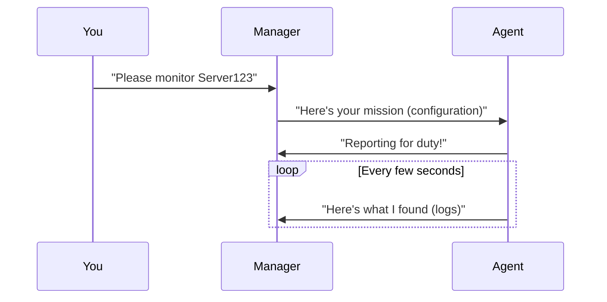
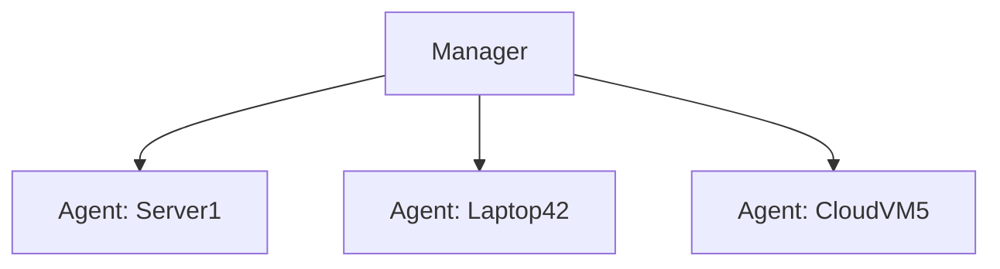

# Chapter 3: Agent Management

## Your Security Helpers Across the Network

Remember when we set up our security dashboard in [Unified Logging/Monitoring](02_unified_logging_monitoring_.md)? Those alerts don't magically appear - they come from little helpers called "agents" installed on all your computers. Think of them like security cameras in every room of a building, all reporting back to the main control center.

## Why Do We Need Agent Management?

Imagine you have:
- 50 office computers
- 20 cloud servers
- 5 remote employee laptops

Without agent management:
- You'd manually install security software on each one
- Updating configurations would take forever
- Some devices might get missed completely

## Our Simple Example: Managing Wazuh Agents

Let's deploy a Wazuh agent to protect a Linux server. Here's how easy it is:

```yaml
# docker-compose.yml snippet for a Linux agent
linux-agent:
  image: debian:bookworm-slim
  environment:
    - WAZUH_MANAGER=wazuh.manager
  command: "install wazuh-agent && connect to manager"
```

What this does:
1. Creates a Linux container (our "server")
2. Installs the Wazuh agent
3. Connects it to our central manager

## How Agent Management Works

Here's what happens behind the scenes:



## Installing an Agent Step-by-Step

1. **Tell the agent where to report**:
```yaml
environment:
  - WAZUH_MANAGER=wazuh.manager
```
(This is like giving a security camera the control room's address)

2. **Install the agent software**:
```bash
wget https://packages.wazuh.com/4.x/apt/wazuh-agent.deb
dpkg -i wazuh-agent.deb
```
(Like putting the camera on the wall and plugging it in)

3. **Start the agent**:
```bash
/var/ossec/bin/wazuh-control start
```
(Flipping the "on" switch)

## Managing Multiple Agents

Need to monitor many devices? The manager keeps track of all of them:



## Key Benefits

1. **Central control**: Manage all agents from one place
2. **Uniform protection**: Every device gets the same security rules
3. **Easy updates**: Change one configuration, update all agents

## What Did We Learn?

Agent management is like having a team of security guards (agents) in every part of your network, all reporting to a central command center (manager). We saw how to:
- Deploy new agents
- Connect them to the manager
- Understand their basic operation

Now that we have our security helpers in place, we need to tell them exactly what to protect! In [Service Configuration](04_service_configuration_.md), we'll learn how to customize their security rules.

---

Generated by [AI Codebase Knowledge Builder](https://github.com/The-Pocket/Tutorial-Codebase-Knowledge)