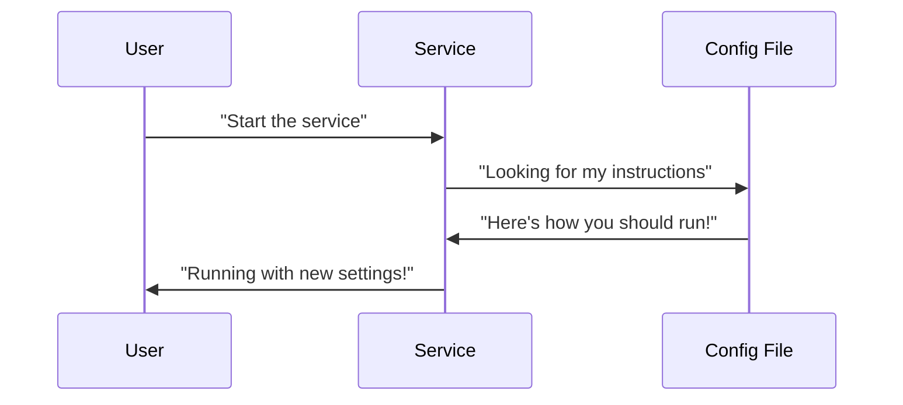

# Chapter 4: Service Configuration

## The Instruction Manual for Security Services

Remember how in [Agent Management](03_agent_management_.md) we set up our security helpers across the network? Now we need to tell them exactly how to do their jobs - that's what **Service Configuration** is all about! Imagine giving each security tool its own personalized instruction manual.

## Why Do We Need Service Configuration?

Think of service configurations like recipes for different security tools:
- Without them: Every tool uses default settings (like cooking without a recipe - risky!)
- With them: Each tool knows exactly what ports to use, how to connect, and what to monitor

Our simple example: Configuring Wazuh to:
1. Listen on specific ports
2. Use the correct encryption
3. Connect to the right logging server

## Configuration Basics

Service configurations come in two flavors:

1. **Static Settings** (like ingredients in a recipe):
```yaml
# Wazuh manager basic config
port: 1514
protocol: udp
ssl_enabled: true
```

2. **Runtime Settings** (like cooking instructions):
```yaml
# How often to check for new rules
rule_update_interval: 12h
max_connections: 1000
```

## Hands-On Example: Securing Wazuh Dashboard

Let's look at a real configuration snippet from our project:

```yaml
# wazuh-dashboard.yml
server.host: 0.0.0.0
server.port: 5601
opensearch.hosts: https://wazuh.indexer:9200
server.ssl.enabled: true
```

This tells the dashboard:
- Listen to all network interfaces (`0.0.0.0`)
- Use port 5601 for connections
- Connect to the indexer securely via HTTPS

## How Configurations Are Applied

Here's what happens when we start a configured service:



1. The service starts
2. Reads its configuration file
3. Applies all settings
4. Starts operating as configured

## Common Configuration Elements

1. **Network Settings** (Where to connect):
```yaml
host: "graylog.example.com"
port: 9000
```

2. **Security Settings** (How to protect):
```yaml
ssl_enabled: true
cert_path: "/certs/server.pem"
```

3. **Behavior Settings** (What to do):
```yaml
scan_interval: 300s
alert_threshold: 10
```

## Real-World Scenario: Updating Log Settings

Let's modify log rotation for Graylog:

```yaml
# Before
retention_size: 1GB
max_log_age: 7d

# After (setting stricter limits)
retention_size: 500MB
max_log_age: 3d
```

This change will:
1. Keep logs smaller (helps with disk space)
2. Retain logs for fewer days (improves security)

## Key Benefits

1. **Customization**: Make each service work exactly how you need
2. **Consistency**: Same settings across all deployments
3. **Security**: Fine-tune security parameters

## What Did We Learn?

Service configuration is like writing personalized instruction manuals for each security tool. We saw how to:
- Set basic network and security parameters
- Understand configuration formats
- Modify real-world settings safely

Now that our services are properly configured, we need to ensure their communications are trustworthy. In [Certificate Management](05_certificate_management_.md), we'll learn how to create and manage digital IDs for our security tools.

---

Generated by [AI Codebase Knowledge Builder](https://github.com/The-Pocket/Tutorial-Codebase-Knowledge)