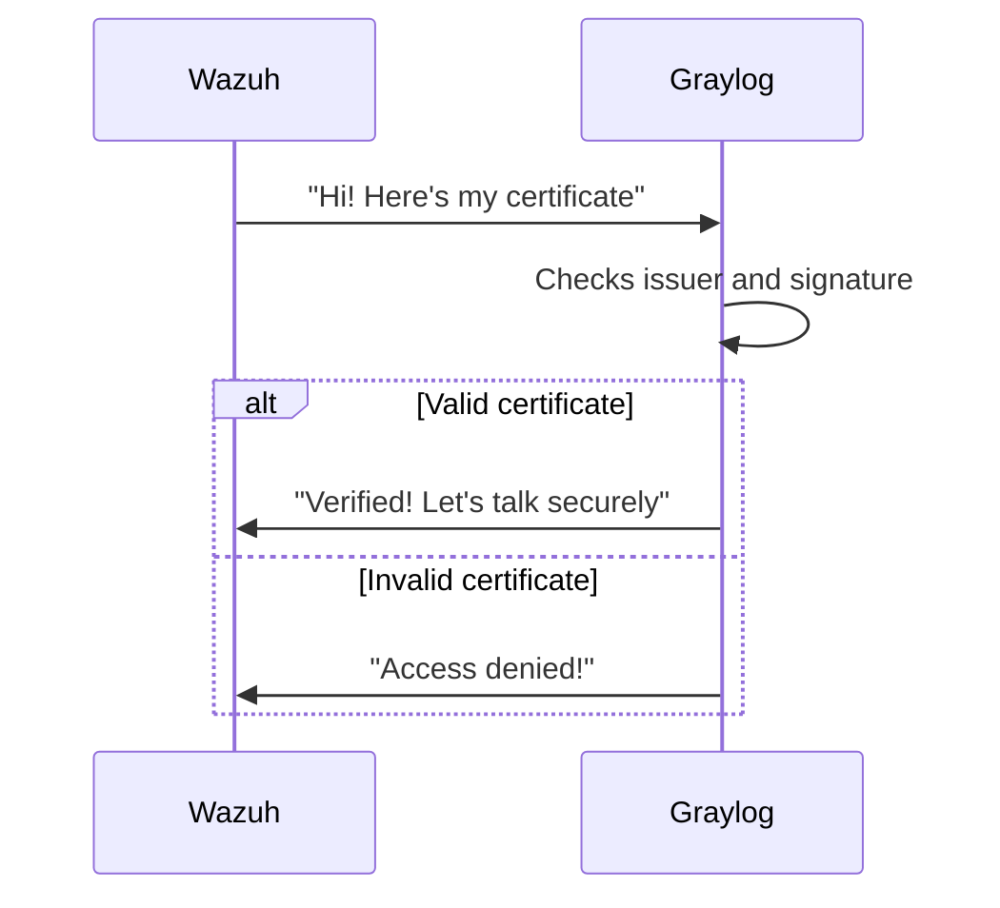
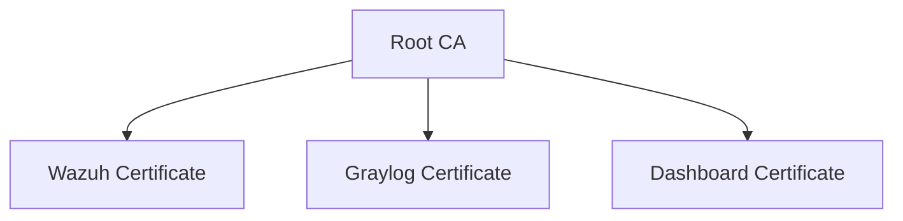

# Chapter 5: Certificate Management

## Digital IDs for Your Security Tools

Remember when we configured our security services in [Chapter 4: Service Configuration](04_service_configuration_.md)? Now we'll give each service a digital ID card - called a certificate - so they can prove who they are when talking to each other. It's like giving each security guard in our system their own official badge!

## Why Do We Need Certificates?

Imagine our security tools (Wazuh, Graylog, etc.) as people in an office:
- Without certificates: Anyone could pretend to be the boss ("Hi, I'm Graylog - give me your logs!")
- With certificates: Each service shows an unforgeable ID badge before sharing information

Our simple example: Securing communication between:
1. Wazuh manager (security alerts)
2. Graylog (log storage)
3. Wazuh dashboard (monitoring)

## Certificate Basics

Certificates answer three key questions:
1. **Who are you?** (Identity)
2. **Are you trustworthy?** (Validation)
3. **How should we talk?** (Encryption)

Here's what a simple certificate looks like in code:

```yaml
# Sample certificate info
name: wazuh.manager
valid_from: 2023-01-01
valid_to: 2024-01-01
issuer: OurSecurityCompany_CA
```

## Creating Certificates in Our Project

Let's look at how we generate certificates for Wazuh:

```bash
# This runs the certificate generator
./wazuh/cert-gen.sh
```

What happens:
1. Creates a root Certificate Authority (CA) - like making our own ID card printer
2. Generates certificates for each service - printing unique badges
3. Places them in the right directories - delivering badges to each service

## How Certificates Keep Communication Safe

Here's the verification process when two services talk:



## Certificate Types in Our System

1. **Root CA Certificate**: The master ID badge printer (most important!)
2. **Server Certificates**: Unique badges for each service
3. **Client Certificates**: For devices that need to connect

Here's how they're organized:



## Hands-On: Checking a Certificate

You can view certificate details with:

```bash
openssl x509 -in /path/to/cert.pem -text -noout
```

This shows:
- Who issued it
- When it expires
- What it's used for

## Key Benefits

1. **Trust**: Services know they're talking to the right partner
2. **Security**: Communications are encrypted
3. **Control**: You decide which certificates to trust

## What Did We Learn?

Certificates are like digital ID cards for our security services. We saw how to:
- Generate certificates for our tools
- Understand how they verify identities
- Check certificate details

Now that our services can communicate securely, we need to understand how they connect across the network. In [Chapter 6: Network Infrastructure](06_network_infrastructure_.md), we'll explore how our security tools talk to each other safely!

---

Generated by [AI Codebase Knowledge Builder](https://github.com/The-Pocket/Tutorial-Codebase-Knowledge)