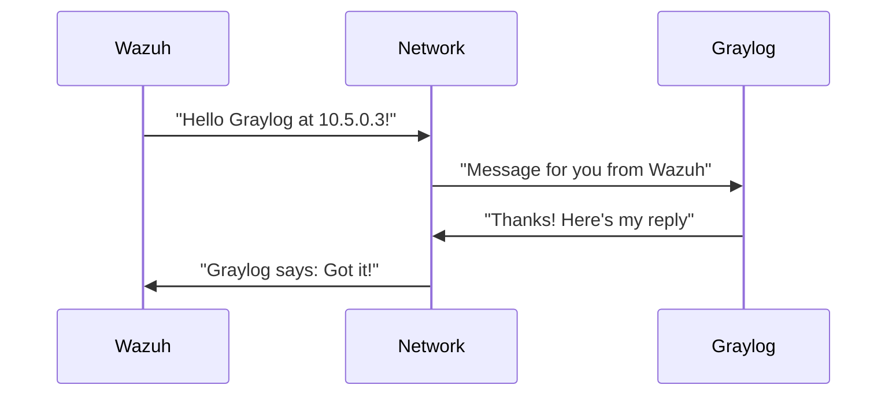
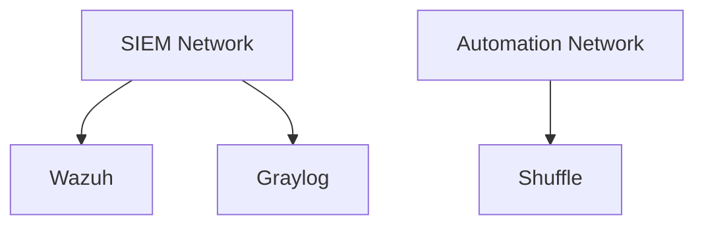

# Chapter 6: Network Infrastructure

## The Digital Highway System for Your Security Tools

After giving our security tools their digital ID cards in [Certificate Management](05_certificate_management_.md), they now need secure roads to communicate on - that's what **Network Infrastructure** provides! Imagine building a city where:

- TheHive (our security responder) lives on Main Street
- Wazuh (our security detector) works on Alert Avenue
- Shuffle (our automation tool) operates on Automation Boulevard

Each needs its own street, but they also need to send messages between them safely!

## Why Do We Need Network Infrastructure?

Think of three office buildings that need to communicate:
- Without networks: They'd shout across town (insecure and messy!)
- With networks: They have private phone lines and secure mail routes

Our simple example: Creating separate networks for:
1. SIEM tools (Wazuh, Graylog)
2. Automation tools (Shuffle)
3. Incident response tools (TheHive)

## Creating a Simple Network

Here's how easy it is to make a Docker network:

```bash
docker network create siem-street
```

This makes:
- A private road only our SIEM tools can use
- Automatic address assignment (like house numbers)
- Built-in security gates

## How Networks Connect Services

See how Wazuh and Graylog connect on their special network:

```yaml
# docker-compose.yml snippet
services:
  wazuh:
    networks:
      - siem-street
  graylog:
    networks:
      - siem-street

networks:
  siem-street:
    driver: bridge
```

This tells Docker:
1. Put both services on "siem-street"
2. Let them talk to each other
3. Keep others out

## Behind the Scenes: Network Traffic

When Wazuh sends a log to Graylog:



1. Wazuh addresses Graylog by its network name
2. The network delivers the message securely
3. Graylog responds through the same private channel

## Keeping Networks Separate

Different tool groups get their own networks:



Benefits:
- **Isolation**: If one network has issues, others stay safe
- **Security**: Services only see who they need to
- **Organization**: Easier to troubleshoot

## Real-World Example: TheHive's Network

Here's how TheHive connects to its database:

```yaml
thehive:
  networks:
    - hive-lane
cortex:
  networks:
    - hive-lane
```

Now they can:
1. Share data privately
2. Block outside access
3. Maintain fast communication

## Key Benefits

1. **Security**: Contained communication channels
2. **Performance**: Faster than public networks
3. **Simplicity**: Easy to see who connects to whom

## What Did We Learn?

Network infrastructure builds private roads for our security tools to communicate safely. We saw how to:
- Create Docker networks
- Connect services
- Maintain isolation between tool groups

Now that our tools can talk securely, we need to ensure their conversations are saved properly. In [Data Persistence](07_data_persistence_.md), we'll learn how to store all this important security information!

---

Generated by [AI Codebase Knowledge Builder](https://github.com/The-Pocket/Tutorial-Codebase-Knowledge)