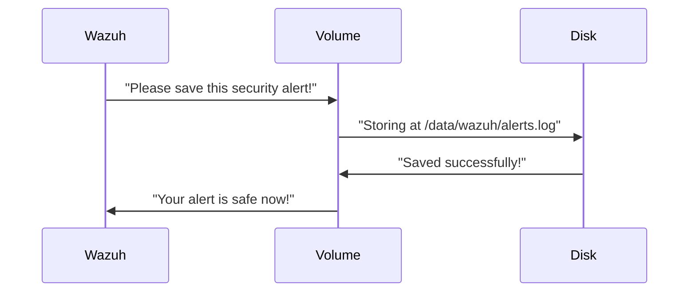
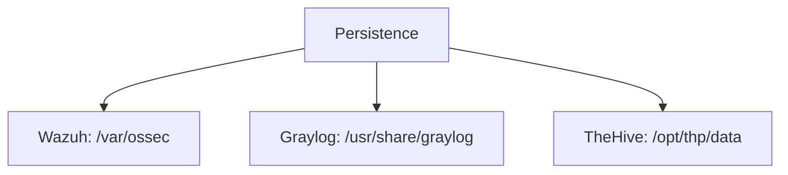

# Chapter 7: Data Persistence

## Your Security Tools' Memory Bank

After setting up secure communication channels in [Network Infrastructure](06_network_infrastructure_.md), our security tools need a place to store all their important information - that's where **Data Persistence** comes in! Imagine each tool has its own digital notebook where it writes down:

- Security alerts (Wazuh's notebook)
- System logs (Graylog's notebook)
- Investigation cases (TheHive's notebook)

## Why Do We Need Data Persistence?

Think what would happen if:
- Your security tools forgot everything after restarting (like having amnesia!)
- All alerts disappeared overnight (very scary for cybersecurity!)
- You couldn't go back to check yesterday's security events

Our simple example: Creating safe storage for:
1. Wazuh's security alerts
2. Graylog's system logs
3. TheHive's investigation cases

## How Persistence Works

Data persistence is like giving each service its own labeled filing cabinet:

```yaml
# In docker-compose.yml
volumes:
  wazuh_logs:
    driver: local
  graylog_data:
    driver: local
```

Here:
- `wazuh_logs` is Wazuh's drawer
- `graylog_data` is Graylog's drawer
- `local` means files stay on *your* computer

## Hands-On: Saving Wazuh's Alerts

Let's see how Wazuh saves its alerts persistently:

```yaml
# Wazuh service config
volumes:
  - wazuh_logs:/var/ossec/logs
```

This tells Wazuh:
- Store all logs in `/var/ossec/logs`
- Keep them safe in the `wazuh_logs` volume
- Never lose them when restarting

## What Happens Behind the Scenes

When Wazuh writes a log entry:



1. Wazuh sends data to its volume
2. Volume saves it to actual disk storage
3. Confirms successful save

## Storage Locations in Our System

Here's where different tools store their data:



## Cleaning Up Storage

Sometimes we need to reset storage (like cleaning a whiteboard). Here's how we safely clear TheHive's data:

```bash
./thehive-cortex/clean.sh
```

This will:
1. Remove old case files
2. Keep configuration intact
3. Prepare fresh storage space

## Key Benefits

1. **Reliability**: Data survives restarts/crashes
2. **Accessibility**: Tools quickly find their data
3. **Security**: Sensitive logs are protected

## What Did We Learn?

Data persistence is like giving each security tool its own memory bank. We saw how to:

- Create persistent storage volumes
- Understand where tools store data
- Safely reset storage when needed

Now that we've covered all the core components of our security system, you're ready to explore how they come together in real-world scenarios!

---

Generated by [AI Codebase Knowledge Builder](https://github.com/The-Pocket/Tutorial-Codebase-Knowledge)