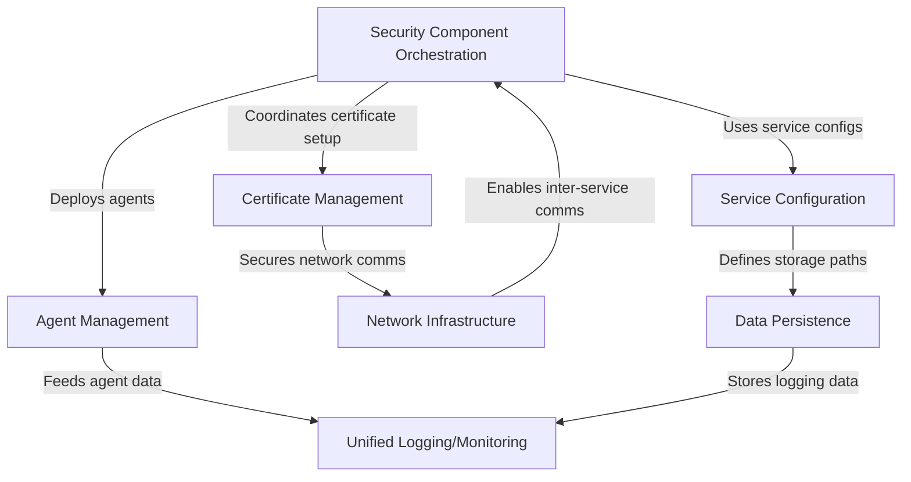

# Tutorial: soc-automation

The **soc-automation** project is a *Security Operations Center (SOC) automation platform* that integrates multiple security tools (**Wazuh**, **Graylog**, **TheHive**, etc.) into a cohesive system. It acts like an *orchestrator* to manage security monitoring, logging, and incident response workflows. Key features include **centralized logging**, **threat detection**, **automated response**, and **visual dashboards**, all secured with proper certificate management and network isolation.

**Source Repository:** [None](None)

## Chapters

1. [Security Component Orchestration
](01_security_component_orchestration_.md)
2. [Unified Logging/Monitoring
](02_unified_logging_monitoring_.md)
3. [Agent Management
](03_agent_management_.md)
4. [Service Configuration
](04_service_configuration_.md)
5. [Certificate Management
](05_certificate_management_.md)
6. [Network Infrastructure
](06_network_infrastructure_.md)
7. [Data Persistence
](07_data_persistence_.md)

---

Generated by [AI Codebase Knowledge Builder](https://github.com/The-Pocket/Tutorial-Codebase-Knowledge)

